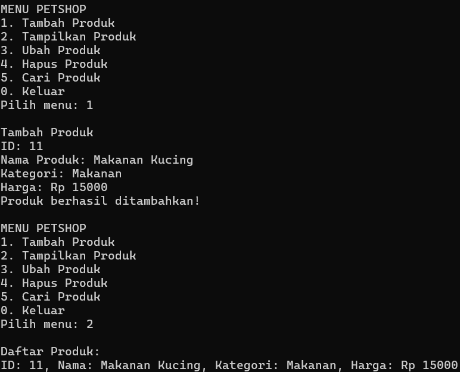
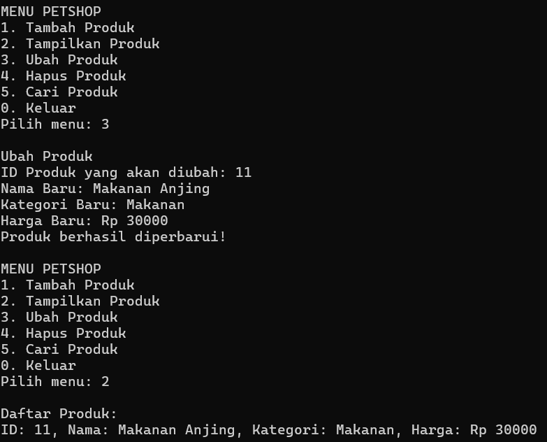
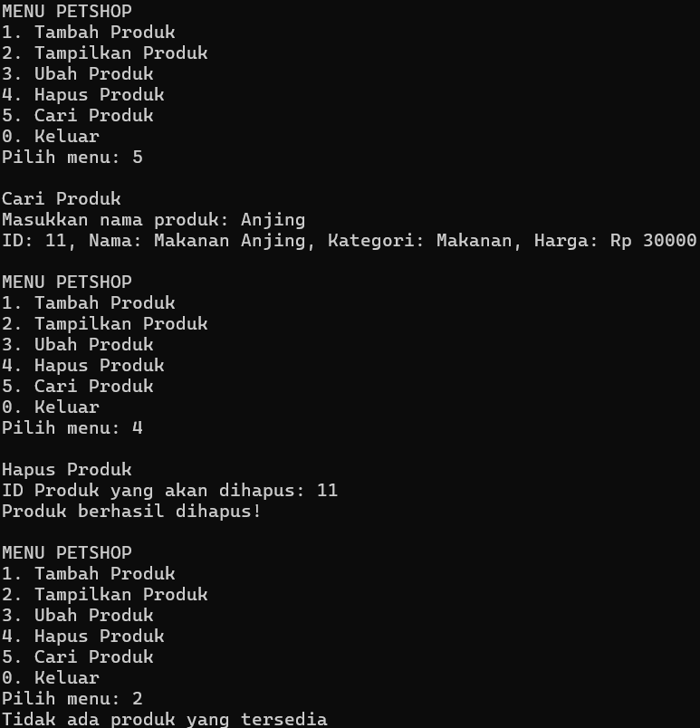
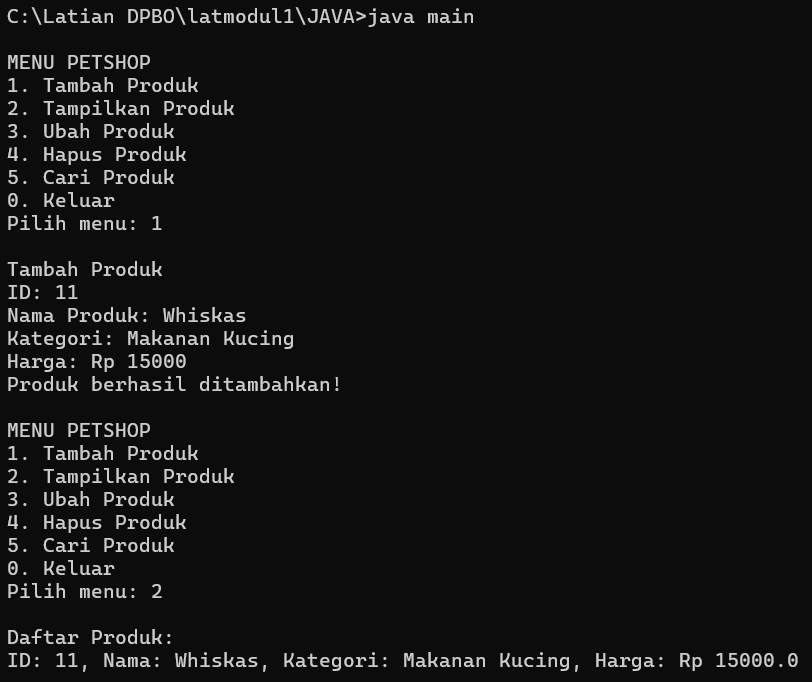
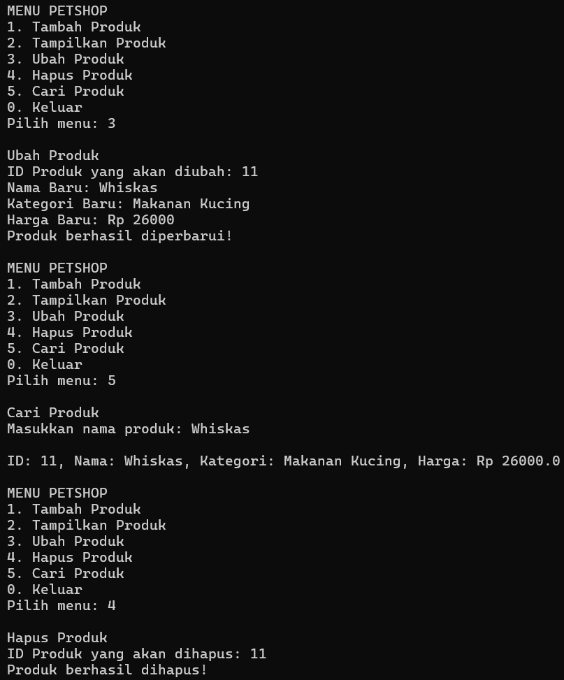
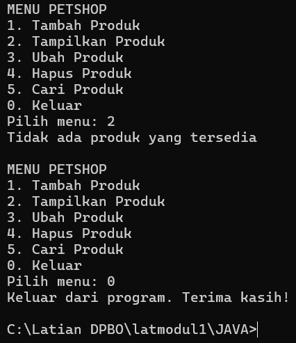

# TP1DPBO2025C2

# Janji
Saya Muhammad Igin Adigholib dengan NIM 2301125 mengerjakan Laporan Praktikum 1 dalam mata kuliah Desain dan Pemrograman Berorientasi Objek untuk keberkahanNya maka saya tidak melakukan kecurangan seperti yang telah dispesifikasikan. Aamiin.

# Penjelasan algoritma keseluruhan
Program yang saya buat yaitu manajemen produk petshop berbasis C++, Java, PHP, Python. Intinya, program ini bisa dipakai buat nambahin, nge-list, edit, hapus, dan nyari produk yang disimpan dalam array (maksimal 100 item). File Petshop.cpp berisi kelas PetShop yang ngatur logika dasarnya, sedangkan main.cpp adalah tampilan menunya yang interaktif. Program ini jalan pake do-while, jadi bakal terus nampilin menu sampai user milih keluar. Khusus pada program PHP dapat menambah foto produk.

# Dokumentasi CPP

# Dokumentasi JAVA

# Dokumentasi PYTHON

# Dokumentasi PHP

